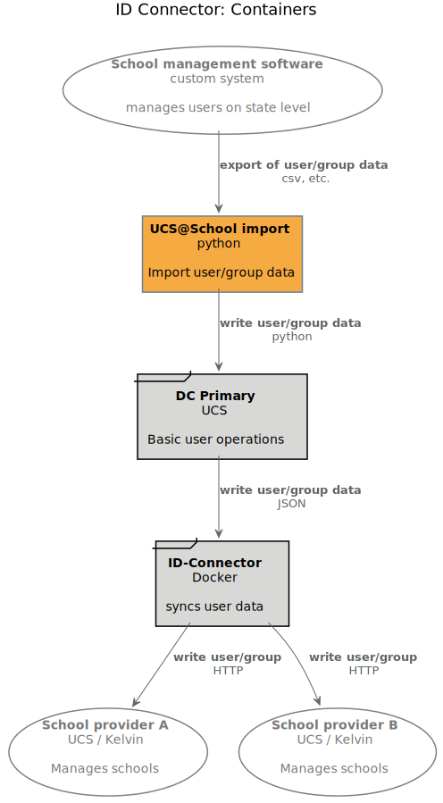
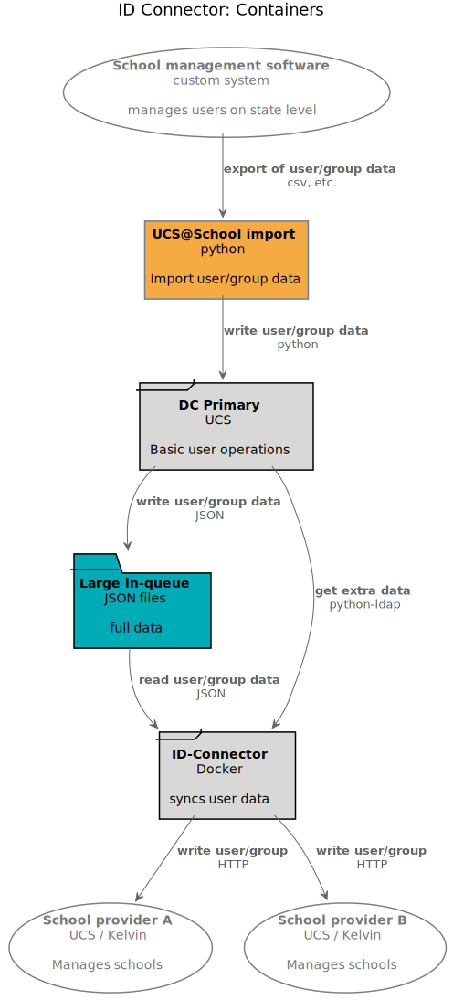
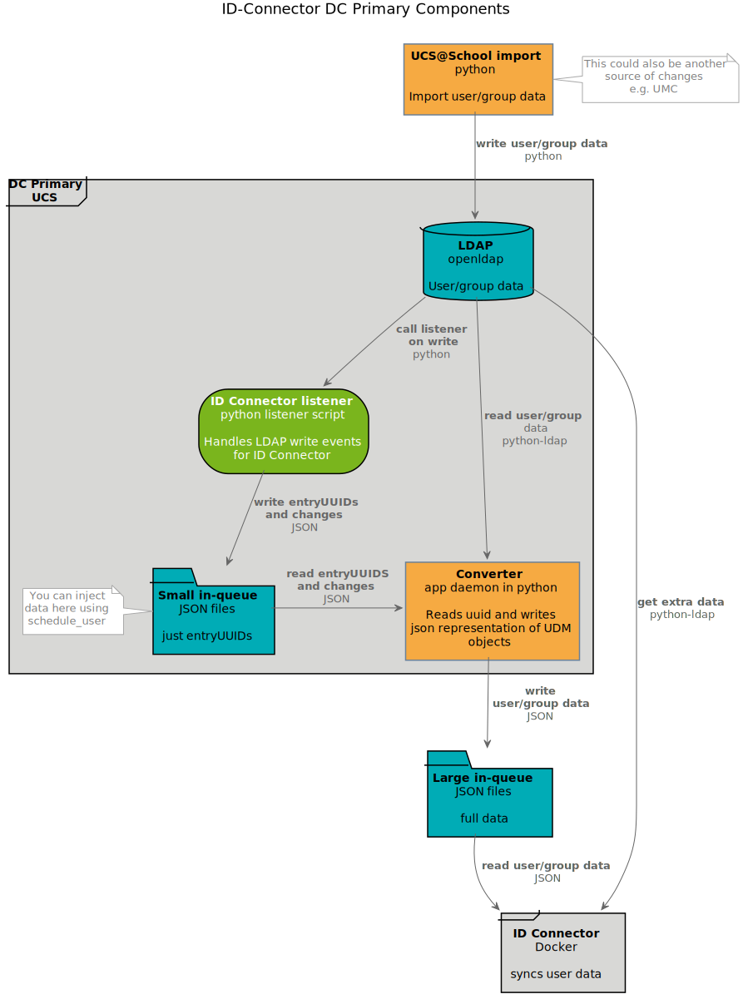
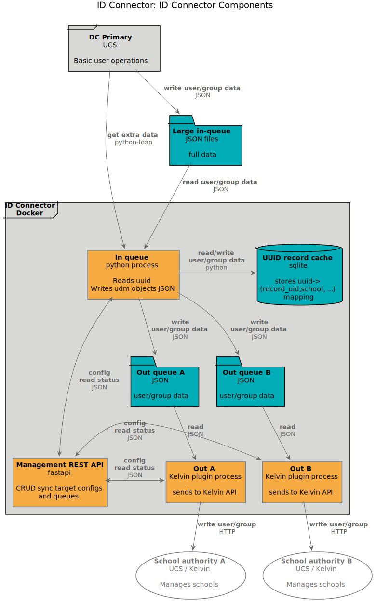
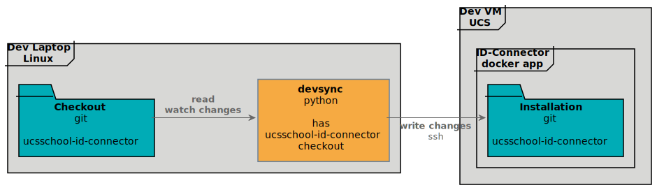

.. include:: <isonum.txt>
.. include:: univention_rst_macros.txt

***********
Development
***********

Dev overview
============

   |IDC| - Containers (`C4 Style <https://c4model.com/>`_)

.. include:: legend.txt

This diagram shows - in a different style - the diagram
at the top of the last chapter :doc:`admin`:

* The *school management software* that runs on the state level, and exports user data in a file
  format, e.g. CSV
* |iUAS| *import* which is a python script to import users into a *DC Primary UCS* System
* The *DC Primary UCS*  system passes on the user/group data to the actual |iIDC| running
  in a docker container
* The |iIDC| finally writes user/group data to the school authorities

This, of course, is a simplification. It is on a container level (in the sense used by
`C4 <https://c4model.com/>`_).

.. note::

   Arrows in these diagrams are in the direction of data flow. It should be apparent from the
   source and target nodes what the label on the arrow refers to.

Let's have a look at what you need to know before we dive any deeper.

Dev prerequisites
=================
First, we assume that you are already familiar with the chapter :doc:`admin`, and the
prerequisites described therein.

You also need the following knowledge to follow this manual and to develop for |IDC|:

HTTP
   The foundation of data communication for the WWW. Our APIs use this.

   You need to be able to:

   - understand HTTP messages
   - understand auth concepts
   - understand error codes

   |rarr| https://developer.mozilla.org/en-US/docs/Web/HTTP

Python & pytest
   The great programming language and its testing module.

   You need to be able to:

   - code and debug python modules
   - test your code, ideally using pytest

   |rarr| https://python.org |br|
   |rarr| https://pytest.org

Fastapi
   The framework in which our HTTP APIs are developed.

   You need to be able to:

   - understand fastapi
   - understand dependency injection
   - understand pydantic models

   |rarr| https://fastapi.tiangolo.com/

Docker
   Software to isolate software and run them in containers.

   You need to be able to:

   - understand Dockerfile basics
   - run containers
   - understand mounts

   |rarr| https://www.docker.com/

Pluggy
   Pluggy is the crystallized core of plugin management and hook calling (from pytest).

   You need to be able to:

   - understand basic concepts of hook specs, hook implementation and hook calling

   |rarr| https://pluggy.readthedocs.io/en/latest/

UDM REST-API (optional)
   A REST API which can be used to inspect, modify, create and delete UDM objects via HTTP requests.

   You will only need to know about this if you want to access extra information about objects
   within your (custom) plugin.

   You need to be able to:

   - understand the structure of UDM objects
   - understand how to read (and maybe write) UDM objects, according to your needs

   |rarr| https://docs.software-univention.de/developer-reference-5.0.html#udm:rest_api

Pre-commit (optional)
   A framework for managing and maintaining multi-language pre-commit hooks.

   This is only needed if you need to commit to the univention |IDC| repo.

   You need to be able to:

   - install pre-commit definitions
   - run pre-commit checks
   - be aware of using different venvs for writing code and running pre-commits

   |rarr| https://pre-commit.com/

Interactions and components
===========================

Let's have a closer look at what's going on.

Overview, less simplified
-------------------------

.. include:: legend.txt

Ok, isn't this more or less the same as above in `Dev overview`_? Yes, right, you are. The additional
element is the *Large in-queue*. This is a folder which interacts as the interface between the
*DC Primary* and the |iIDC|. JSON files are written to the folder, and then read out.

You also may notice the *get extra data* arrow. This means that the |IDC| might need
extra data that is not contained in the JSON files. But before we come to this, we have a closer
look at the *DC Primary*

DC Primary
----------

.. include:: legend.txt

* The |iUCS| *import*, a python script, reads in e.g. CSV data, and writes the contained user and
  group data to the *LDAP*. As mentioned in the diagram, there are other mechanisms that
  modify the LDAP, the UMC being one of them. The point is that user/group data
  "somehow" arrives.

* The |iIDC| *listener* python script is then called by the LDAP machinery. It handles
  the write events that are of interest for the |IDC|.

* In a first step this data is written to the *small in-queue*. This is a folder containing
  minimal information (in JSON format), namely the type of change (add, update, delete) and
  the entryUUID of the concerned object. But why not write directly to the *Converter*
  in the next step? The reason is twofold:

  1. Speed by decoupling - the LDAP listeners should be able to do their job as fast as possible,
     and shouldn't have to wait for the next processing steps. Hence the folder acting as a queue,
     and only writing minimal data.
  2. The folder can also act as an entry point for debugging and manual insertion of user data. E.g.
     you want to reschedule a user without import the user again? Use the ``schedule_user`` script,
     and this will write some JSON into this folder.

* The *Converter* runs as a daemon script, picks up the JSON files from the *small in-queue*,
  and fetches the actual data from the *LDAP* using the ``python-ldap``. It then puts a JSON
  representation of the UDM Object into the *Large in-queue*.

The *Large in-queue* in turn is read out by the |iIDC| running in a docker container.
Let's have a closer look:

ID Connector
------------

.. include:: legend.txt

* We already know that the *DC Primary* writes data to the *Large in-queue*. This folder is
  accessible by the host UCS system as well be the |iIDC| docker container (where
  it is mounted).
* *In Queue* is a python process, that reads out the *Large in-queue*. It still might need
  extra data from the LDAP in the *DC Primary*, which it will do using ``python-ldap``.
  For caching purposes it uses an ``sqlite`` database as a caching mechanism, the
  *UUID record cache*.
* The *In Queue* decides, what user/group data to send where (using the
  :ref:`school_to_authority_mapping` in the process). For each potential recipient there is
  a separate *Out queue*. User/group data is written in JSON format into the respective folder.
* The JSON data is picked up the plugin processes, e.g. *Out A*. Usually there is only the
  ``Kelvin ID Connector plugin``, which helps |IDC| to talk to Kelvin REST APIs.
  The Kelvin plugin process then talks to Kelvin API on the *School authority A*, doing the final
  transmission of the user/group data.
* All this orchestrated by the *Management REST API*, which is mostly for managing out queues.

.. hint::

    You have learned about *Management REST API* in :ref:`ucs_school_id_connector_http_api`.

Complete picture
----------------

The complete picture is a bit crowded. If you want see it anyway, here are your choices:

.. collapse:: Complete overview, C4 style

    .. figure:: images/id-connector-unified.svg
       :width: 800

    .. include:: legend.txt

.. collapse:: Overview, manually drawn, with file locations

    .. figure:: images/ucsschool-id-connector_details2.svg
       :width: 800

       The |IDC|, *not* simplified.

Dev setup
==========

Sadly, you can't develop everything on your developer machine / laptop:
running the |IDC| requires an LDAP, listeners etc., so you really need a full-blown
UCS installation. Hence, we rather have a local checkout on the dev machine,
and then sync the code changes into an |IDC| container that is running on a VM.

.. include:: legend.txt

We are going to develop with the following setup:

* You have a git *checkout* of the *ucsschool-id-connector* on your *dev machine*
* There you use the script *devsync* to synchronize changes,
* which are synced to the corresponding *installation* folder of the |iIDC| docker app.

.. note::
    If you don't have *devsync* (from the toolshed), you might as well use scp, rsync, or any
    other transfer mechanism of your liking.

Dev machine
-----------

Setup development environment:

.. code-block:: bash

    $ # clone ucsschool-id-connector
    $ cd ucsschool-id-connector
    $ make setup_devel_env
    $ . venv/bin/activate
    $ make install
    $ pre-commit run -a

This will create a directory ``venv`` with a Python virtualenv with the app and all its dependencies in it.

You can later on also "activate" the ``venv`` using:

.. code-block:: bash

    $ . venv/bin/activate

.. warning::

    All other commands in the Makefile assume that the virtualenv is activated.

Run ``make`` without argument to see more useful commands:

.. code-block::

    $ make

    clean                     remove all build, test, coverage and Python artifacts
    clean-build               remove build artifacts
    clean-pyc                 remove Python file artifacts
    clean-test                remove test and coverage artifacts
    setup_devel_env           setup development environment (virtualenv)
    lint                      check style (requires Python interpreter activated from venv)
    format                    format source code (requires Python interpreter activated from venv)
    test                      run tests with the Python interpreter from 'venv'
    coverage                  check code coverage with the Python interpreter from 'venv'
    coverage-html             generate HTML coverage report
    install                   install the package to the active Python's site-packages
    build-docker-img          build docker image locally quickly
    build-docker-img-on-knut  copy source to docker.knut, build and push docker image

Dev VM
------

You need to install the |IDC| app through the |AppC| on your development vm.

When started through the |AppC| use the following to enter the container of the app:

.. code-block:: bash

    $ univention-app shell ucsschool-id-connector

Inside the container, you can use the system Python:

.. code-block:: bash

    /ucsschool-id-connector$ python3
    Python 3.8.2 (default, Feb 29 2020, 17:03:31)
    [GCC 9.2.0] on linux
    Type "help", "copyright", "credits" or "license" for more information.
    >>> from ucsschool_id_connector import models

    /ucsschool-id-connector$ ipython
    Python 3.8.2 (default, Feb 29 2020, 17:03:31)
    Type 'copyright', 'credits' or 'license' for more information
    IPython 7.13.0 -- An enhanced Interactive Python. Type '?' for help.

    In [1]: from ucsschool_id_connector import models

Now, in order to sync  your working copy into the running |IDC| container on the dev vm,
we need to:

1. Stop the |IDC| in it's container,
2. Find out its ID,
3. Use this ID to sync the files into the container,
4. Restart and prepare the container for development.

Lets do it!

.. code-block:: bash

    # [dev VM] stop the actual ID Connector in it's docker container
    $ docker exec "$(ucr get appcenter/apps/ucsschool-id-connector/container)" \
      /etc/init.d/ucsschool-id-connector stop

    #[dev VM] find out the ID
    $ docker inspect --format='{{.GraphDriver.Data.MergedDir}}' \
    "$(ucr get appcenter/apps/ucsschool-id-connector/container)"

    →  /var/lib/docker/overlay2/8dc...387/merged

    # [developer machine] use the ID to sync our local modified files
    ucsschool-id-connector$ devsync -v src/ \
    <IP of dev VM>:/var/lib/docker/overlay2/8dc...387/merged/ucsschool-id-connector/

    # [dev VM] enter the container
    $ univention-app shell ucsschool-id-connector

    # [in container] install the dev requirements
    $ python3 -m pip install --no-cache-dir -r src/requirements.txt -r src/requirements-dev.txt

    # [in container] install ID Connector from source in development mode
    $ python3 -m pip install -e src/

    # [in container] start the ID Connector
    $ /etc/init.d/ucsschool-id-connector restart

    # [in container] stop the Rest API
    $ /etc/init.d/ucsschool-id-connector-rest-api stop

    # [in container] start the REST API in auto-reloading dev mode
    $ /etc/init.d/ucsschool-id-connector-rest-api-dev start

    # [in container] schedule a user
    $ src/schedule_user demo_teacher

    # DEBUG: Searching LDAP for user with username 'demo_teacher'...
    # INFO : Adding user to in-queue: 'uid=demo_teacher,cn=lehrer,cn=users,ou=DEMOSCHOOL,dc=uni,dc=dtr'.
    # DEBUG: Done.

    # Log is in /var/log/univention/ucsschool-id-connector/queues.log

Run unit tests
--------------

Unit tests are executed as part of the :ref:`build process <Building>`.
To start them manually in the installed apps running Docker container, run:

.. code-block:: bash

    root@ucs-host:# univention-app shell ucsschool-id-connector
    $ cd src/
    $ python3 -m pytest -l -v tests/unittests
    $ exit

Plugin development
==================

How does the plugin system work?
--------------------------------

The code of the |iUASIDC| app can be adapted through plugins.
The `pluggy <https://pluggy.readthedocs.io/en/latest/>`_ plugin system is used
to define, implement and call plugins.

.. hint::
    To get a quick freshen up on pluggy, best have a look at the
    `toy example <https://pluggy.readthedocs.io/en/latest/#a-toy-example>`_
    in the pluggy documentation.

The basic idea:

* specify hook specifications: callables with the signature you
  want to have, decorated with a ``hook_spec`` marker.
* write actual hook implementations, a.k.a. 'plugins' that are later on called:
  callables with the same name and signature as in the specification, but this
  time decorated with a ``hook_impl`` marker

The ``hook_spec`` and ``hook_impl`` marker are already defined by the |IDC| system,
you just need to use them. The same way, calling your custom plugin is also catered for,
as well as finding your plugins.

The key file for |IDC| in this context is ``src/ucsschool_id_connector/plugins.py``.
In there you find the ``hook_spec`` and ``hook_impl`` markers.

In this file you also find the plugin *specifications* (function signatures) - they
are decorated with ``@hook_spec``.

The app is released with default plugins, that implement a default version
for all specifications found in ``src/ucsschool_id_connector/plugins.py``.
Search for ``@hook_impl`` in ``src/plugins`` to find them.

Some of the default plugins are only used if no custom plugins are present (see
usages of ``filter_plugins`` defined in ``src/src/ucsschool_id_connector/plugins.py``):

- create_request_kwargs
- school_authority_ping
- handle_listener_object

A simple custom plugin
----------------------

The following demonstrates a simple example of a custom plugin for |IDC|.

The directory structure for your custom plugins (and packages, see below in `Advanced example`_)
can be found in the host system in
``/var/lib/univention-appcenter/apps/ucsschool-id-connector/conf/``::

    /var/lib/univention-appcenter/apps/ucsschool-id-connector/conf/plugins/packages/
    /var/lib/univention-appcenter/apps/ucsschool-id-connector/conf/plugins/plugins/

You can put a file containing a plugin class into the ``plugins/plugins`` directory.
E.g. save the following into a file called ``myplugin.py``:

.. code-block:: python

    from ucsschool_id_connector.utils import ConsoleAndFileLogging
    from ucsschool_id_connector.plugins import hook_impl, plugin_manager
    logger = ConsoleAndFileLogging.get_logger(__name__)

    class MyPlugin:

        @hook_impl
        def get_listener_object(self, obj_dict):
            logger.info("Myplugin runs get_listener_obj with %r", obj_dict)

    plugin_manager.register(MyPlugin())

Restart the |IDC|:

.. code-block:: bash

    $ univention-app  restart ucsschool-id-connector

Now check the queues log in ``/var/log/univention/ucsschool-id-connector/queues.log``
and find entries like this::

    2021-12-13 14:32:52 INFO  [ucsschool_id_connector.plugin_loader.load_plugins:79] Loaded plugins:
    [...]
    2021-12-13 14:32:52 INFO  [ucsschool_id_connector.plugin_loader.load_plugins:81]     'myplugin.MyPlugin': ['get_listener_object']

This tells you that ``MyPlugin`` was found and the hook implementation for ``get_listener_object`` was found.

Advanced example
----------------

In this example, you will learn how to additionally:

* define your own hook specs
* use an extra package for shared code across plugins.

The directory structure for a custom plugin ``dummy`` and custom package ``example_package``
below ``/var/lib/univention-appcenter/apps/ucsschool-id-connector/conf/`` looks as follows:

.. code-block:: bash

    .../plugins/
    .../plugins/packages
    .../plugins/packages/example_package
    .../plugins/packages/example_package/__init__.py
    .../plugins/packages/example_package/example_module.py
    .../plugins/plugins
    .../plugins/plugins/dummy.py

.. note::

    Putting the ``example_package`` into the ``packages`` directory solves
    an import problem. As the ``packages`` directory is appended to the ``sys.path`` by
    the module loader in ``plugin_loader.py``, packages herein can be imported
    easily without being 'properly' installed.

Content of ``plugins/packages/example_package/example_module.py``:

.. code-block:: python

    #
    # An example Python module that will be loadable as "example_package.example_module"
    # if stored in 'plugins/packages/example_package/example_module.py'.
    # Do not forget to create 'plugins/packages/example_package/__init__.py'.
    #

    from ucsschool_id_connector.utils import ConsoleAndFileLogging

    logger = ConsoleAndFileLogging.get_logger(__name__)

    class ExampleClass:
        def add(self, arg1, arg2):
            logger.info("Running ExampleClass.add() with arg1=%r arg2=%r.", arg1, arg2)
            return arg1 + arg2

Content of ``plugins/plugins/dummy.py``:

.. code-block:: python

    #
    # An example plugin that will be usable as "plugin_manager.hook.dummy_func()".
    # It uses a class from a module in a custom package:
    # plugins/packages/example_package/example_module.py
    #

    from ucsschool_id_connector.utils import ConsoleAndFileLogging
    from ucsschool_id_connector.plugins import hook_impl, hook_spec, plugin_manager
    from example_package.example_module import ExampleClass

    logger = ConsoleAndFileLogging.get_logger(__name__)

    class DummyPluginSpec:
        @hook_spec(firstresult=True)
        def dummy_func(self, arg1, arg2):
            """An example hook."""

    class DummyPlugin:
        @hook_impl
        def dummy_func(self, arg1, arg2):  # <-- this must match the specification!
            """
            Example plugin function.

            Returns the sum of its arguments.
            Uses a class from a custom package.
            """
            logger.info("Running DummyPlugin.dummy_func() with arg1=%r arg2=%r.", arg1, arg2)
            example_obj = ExampleClass()
            res = example_obj.add(arg1, arg2)
            assert res == arg1 + arg2
            return res

    # register plugins
    plugin_manager.register(DummyPlugin())

When the app starts, all plugins will be discovered and logged:

You will then find successful messages like this in the queues log in
``/var/log/univention/ucsschool-id-connector/queues.log``:

.. code-block:: bash

   ...
   INFO  [ucsschool_id_connector.plugins.load_plugins:83] Loaded plugins: {.., <dummy.DummyPlugin object at 0x7fa5284a9240>}
   INFO  [ucsschool_id_connector.plugins.load_plugins:84] Installed hooks: [.., 'dummy_func']
   ...

Building
========

Build docker image
------------------

Build the docker image:

.. code-block:: bash

    $ make build-docker-img

The image can't easily be used productively, so this only for testing/dev purposes:

.. code-block:: bash

    $ docker run -p 127.0.0.1:8911:8911/tcp --name ucsschool_id_connector \
      docker-test-upload.software-univention.de/ucsschool-id-connector:$(cat VERSION.txt)

.. note::

    When the container is started that way (not through the |AppC|)
    it must be accessed through ``https://FQDN:8911/ucsschool-id-connector/api/v1/docs``
    after stopping the firewall (``service univention-firewall stop``).

You can also:

.. code-block:: bash

    # let it run in the background.
    $ docker run -d ...

    # see the stdout
    $ docker logs ucsschool_id_connector

    # stop the running container
    $ docker stop ucsschool_id_connector

    # remove the container
    $ docker rm ucsschool_id_connector

To enter the running container run:

.. code-block:: bash

    $ docker exec -it ucsschool_id_connector /bin/ash

Build release image
-------------------

.. warning::

    You need to be an univention developer to use this section

* Update the apps version in ``VERSION.txt``.
* Add an entry to ``src/HISTORY.rst``.
* Build and push Docker image to Docker registry

To upload ("push") a new Docker image to the Univention Docker registry
(``docker-test.software-univention.de``), run:

.. code-block:: bash

    $ cd ~/git/ucsschool-id-connector
    $ make build-docker-img-on-knut

Integration tests
=================

Univention has automated integration tests. These are configured from this Jenkins config file:

https://github.com/univention/univention-corporate-server/blob/5.0-1/test/scenarios/autotest-244-ucsschool-id-sync.cfg

If you want to manually set up integration tests, for the moment, you need to look there
for hints on how to do it.
