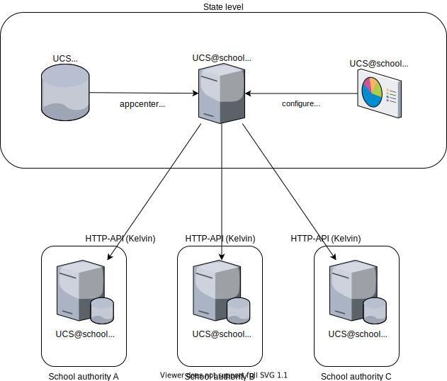

.. ID Connector documentation main file, created by
   sphinx-quickstart on Tue Nov  2 14:56:07 2021.
   You can adapt this file completely to your liking, but it should at least
   contain the root toctree directive.
.. include:: <isonum.txt>
.. include:: univention_rst_macros.txt
.. title:: ID-Connector - Welcome to UCS@School ID Connector Documentation

****************************************************
Welcome to |UAS| ID Connector's documentation!
****************************************************

.. image:: https://img.shields.io/badge/License-AGPL%20v3-orange.svg
    :alt: GNU AGPL V3 license
    :target: https://www.gnu.org/licenses/agpl-3.0
.. image:: https://img.shields.io/badge/python-3.8-blue.svg
    :alt: Python 3.8
    :target: https://www.python.org/downloads/release/python-382/

Overview
========

The |IDC| connects an |UAS| directory to any number of other |UAS| directories (1:n).
It is designed to connect state directories with school districts,
but can also be used in other contexts.
The connection takes place unidirectional: user data (user, school affiliation, class affiliations)
is transferred from a central directory (e.g. country directory) to district or school directories.
Prerequisite is the use of the |iUAS| |iKLV| API on the school authorities.
For this a configuration is necessary in advance to create an assignment
"Which school users should be transferred to which remote instance?"
Then these users are created, updated and deleted.

In this documentation, you will learn how to administer an id-connector setup,
and we hope to teach you how to develop plugins for id-connector as well.

.. _l10n:

.. note::

   At the moment, the ID-Connector setup is only used in German-speaking countries. Hence, you will
   encounter a few German terms in this documentation.

   Sender
      An easy one to guess - it actually refers to the sending side of the sync process,
      which in Germany most likely is a state department.

   Traeger
      This is the organization managing schools. In the ID-Connector context it can be thought
      of as the *recipient* of sync data.

.. note::

   You can use the clipboard icon on the top right of code examples
   to easily copy the code without python and bash prompts:

   .. code-block:: bash

       $ echo "hello world"

   (Hover with your mouse over the code to see the icon)

Contents
========

.. toctree::
   :maxdepth: 4
   :numbered: 3

   admin
   development
   file_locations
   example_json
   HISTORY

Indices and tables
==================

* :ref:`genindex`
* :ref:`modindex`
* :ref:`search`
