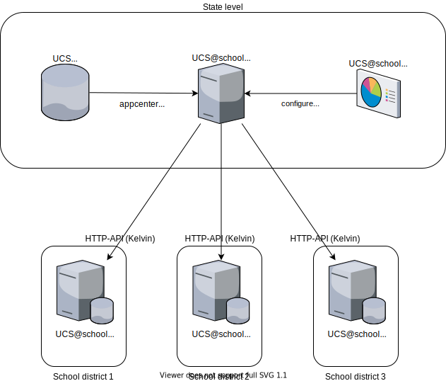

.. This file is formatted in the spirit of
   https://rhodesmill.org/brandon/2012/one-sentence-per-line/

**************
Administration
**************

Overview
========

   Simplified overview of the id-connector

The *UCS\@school ID Connector* replication system is composed of four components:

1. An *LDAP server* containing user data.
2. A process on the data source UCS server,
   receiving user creation/modification/deletion events from
   the LDAP server and relaying them to multiple recipients via HTTP.
   Henceforth called the *UCS\@school ID Connector service*.
3. A process on the data source UCS server to monitor and configure
   the UCS\@school ID Connector service,
   henceforth called the *UCS\@school ID Connector HTTP API*.
4. Multiple recipients of the directory data relayed by the
   *UCS\@school ID Connector service*.
   They run a HTTP-API service, that the
   *UCS\@school ID Connector service* pushes updates to.

The changelog is in the :doc:`HISTORY` file. (TODO: correctly linked?)

TODO: macros for names, to have the consistent writing all the time

Prerequisites
============
This chapter is useful when you need to administer an id-connector setup,
or you need to integrate id-connector.
To actually follow this manual you should be familiar with the following aspects
of the UCS environment:

LDAP and LDAP listener
   LDAP is used because it is optimized for reading in a hierarchical structure.
   It shouldn't be accessed directly, instead `UDM`_ should be used. TODO correct link
   OpenLDAP can have plugins, notifier being one of them that is heavily used in UCS.
   Upon changes in the LDAP directory the notifier triggers listeners locally
   and on remote systems.

   The listener service connects to all local or remote notifiers in the domain.
   The listener, when notified, calls listener modules,
   which are scripts (in shell and python)

   You need to be able to:
      - understand the basic concepts of LDAP

   read more: https://docs.software-univention.de/manual-5.0.html#introduction:LDAP_directory_service

.. _UDM:
UDM
   Univention Directory Management (UDM) is used for handling user data
   (and other data) that is stored in the LDAP server,
   one of two core storage places (the other one is `UCR`_). TODO proper link
   Examples for data are users, roles or machine info.
   UDM adds a layer of functionality and logic on top of LDAP,
   hence LDAP shouldn't be used directly, but only through UDM.

   You need to be able to:
     - the concept of UDM
     - know the basic structure of udm objects and their attributes
     - adding and manage extended attributes

   read more:
     - TODO Nico simple UDM documentation. Where are the basic concepts defined?
     - https://docs.software-univention.de/developer-reference-5.0.html#chap:udm

.. _UCR:
UCR
   The Univention Config Registry.
   It stores configuration variables and settings to run the system,
   and creates and changes actual linux configuration files
   as configured by these variables upon setting said variables.

   You need to be able to:
      - understand basic UCR concepts
      - set and read UCR variables.

   read more:
      - https://docs.software-univention.de/handbuch-5.0.html#computers:Verwaltung_der_lokalen_Systemkonfiguration_mit_Univention_Configuration_Registry

appcenter settings
   Univention App Center is an ecosystem similar to the app stores known from mobile platforms
   like Apple or Google.
   It provides an infrastructure to build, deploy and run enterprise applications
   on Univention Corporate Server (UCS).
   The App Center uses well-known technologies like Docker.

   Within the app center you can configure settings for the individual apps.

   read more:
      - TODO Nico - documentation on how to set app settings. What we have so far is only:
         - https://docs.software-univention.de/app-provider.html#app-settings
         - https://docs.software-univention.de/manual-5.0.html#appcenter-configure

UCS\@school basics
   Schools have special requirements for managing what is going on inside them
   (teachers, students, staff, computer rooms, exams, etc.),
   and for managing the relation between multiple schools,
   their operator organizations ("Schulbetreiber"), and possibly
   ministerial departments above them.

   There are several components used within UCS\@school,
   Kelvin (see below) being one of them.

   You need to be able to:
   - know about UCS\@school objects
   - know the difference between UCS\@school-objects and UDM objects

   read more:
   - https://help.univention.com/t/how-a-ucs-school-user-should-look-like/15630
   - https://help.univention.com/t/ucs-school-work-groups-and-school-classes/16925
   - https://docs.software-univention.de/ucsschool-handbuch-4.4.html
   - TODO Nico english needed, basic concepts would be needed

Kelvin administration
   The UCS\@school Kelvin REST API provides HTTP endpoints
   to create and manage individual UCS\@school domain objects
   like school users, school classes, schools (OUs) and computer rooms.
   This is written in fastapi, hence in python3.

   You need to be able to install and configure kelvin.

   read more:
     - https://docs.software-univention.de/ucsschool-kelvin-rest-api/overview.html
     - TODO Nico concepts of properties and mappings (not sample files, but answering the why, and
       describing the problem that Kelvin solves)
      - best so far: https://docs.software-univention.de/ucsschool-handbuch-4.4.html#structure:ldap

If you want to also develop for id-connector, please also see the next chapter :doc:`plugins`.

Installation
============

Sending side
------------

The app is  available in the appcenter. You can install it with::

    $ univention-app install ucsschool-id-connector

This should run the  join script ``50ucsschool-id-connector.inst``, which creates:

* the file ``/var/lib/univention-appcenter/apps/ucsschool-id-connector/conf/tokens.secret``
  containing the key with which JWT tokens are signed.
* the group ``ucsschool-id-connector-admins``
  (with DN ``cn=ucsschool-id-connector-admins,cn=groups,$ldap_base``)
  who's members are allowed to access the HTTP-API.

Use of both files is explained later on in `Authentication`_

.. note::
    join scripts are registered in LDAP and then executed on any UCS system
    either before/during/after the join process.

    Read more: https://help.univention.com/t/a-script-shall-be-executed-on-each-or-a-certain-ucs-systems-before-during-after-the-join-process/13034

If the files didn't get created, run::

    $ univention-run-join-scripts --run-scripts --force 50ucsschool-id-connector.inst

This forces the (re-)running of the join script.

Target system
---------------------

TODO: name the kelvin plugin

In order for the for the *UCS\@school ID Connector* app to be able to create/modify/delete users
on the target systems an HTTP-API is required on the target system.
Currently only the Kelvin API is supported.

.. note::
  This of course only makes sense if the target system is in a different domain,
  because otherwise users and groups are synced with other UCS mechanisms.

Install the kelvin api on each target system::

    $ univention-app install ucsschool-kelvin-rest-api

To allow the *UCS\@school ID Connector* app to access the APIs
it needs an authorized user account.
By default the Administrator account is the only authorized user.
To add a dedicated Kelvin API user for the UCS\@school ID-Connector
consult the `Kelvin documentation <https://docs.software-univention.de/ucsschool-kelvin-rest-api/>`_
on how to do that.

TODO: link to proper section in documentation
      - write the proper section first

Configuration
=============

Sending side
------------

The school authorities configuration must be done
through the *UCS\@school ID Connector HTTP API*.
Do not edit configuration files directly.

UCS\@school ID Connector HTTP API
~~~~~~~~~~~~~~~~~~~~~~~~~~~~~~~~~
The HTTP-API of the *UCS\@school ID Connector* app offers two resources:

* *queues*: monitoring of queues
* *school_authorities*: configuration of school authorities

You can discover the API interactively using one of two web interfaces.
They can be visited with a browser at the URLS:

* `Swagger UI <https://github.com/swagger-api/swagger-ui>`_: https://FQDN/ucsschool-id-connector/api/v1/docs
* `ReDoc <https://github.com/Rebilly/ReDoc>`_: https://FQDN/ucsschool-id-connector/api/v1/redoc

The Swagger UI page is especially helpful as it allows to send queries directly from the browser
for which equivalent ``curl`` command lines are then displayed.

An `OpenAPI v3 (formerly "Swagger") schema <https://swagger.io/docs/specification/about/>`_

can be downloaded from https://FQDN/ucsschool-id-connector/api/v1/openapi.json

Authentication
~~~~~~~~~~~~~~

To use the API, a `JSON Web Token (JWT) <https://en.wikipedia.org/wiki/JSON_Web_Token>`_ must be
retrieved from ``https://FQDN/ucsschool-id-connector/api/token``.
The token will be valid for a configurable amount of time (default 60 minutes),
after which they must be renewed.
To change the TTL, open the apps *app settings* in the UCS app center.

Example ``curl`` command to retrieve a token::

    $ curl -i -k -X POST --data 'username=Administrator&password=s3cr3t' https://FQDN/ucsschool-id-connector/api/token

Only members of the group ``ucsschool-id-connector-admins`` are allowed to access the HTTP-API.

The user ``Administrator`` is automatically added to this group for testing purposes.
In production only the regular admin user accounts should be used.

Mapping
~~~~~~~
In order to send user data to the target system, it must be decided
which properties of which objects to send, and more important,
which properties not to send.
E.g. there might be insurance numbers numbers for student in the system on the sending side,
but those should not be made available on the receiving school system.
Instead of forbidding properties we "map" properties on the sending side
to properties on the receiving side.

TODO: introduce the mapping. Import error - udm_properties are nowhere explained.

* The UDM ``ucsschoolRecordUID`` property should be synced to an UCS\@school system as ``record_uid``.
* The UDM ``ucsschoolSourceUID`` property should be synced to an UCS\@school system as ``source_uid``.
* The *virtual* UDM ``roles`` property should be synced to an UCS\@school system as ``roles``

.. note::
   ``roles`` is *virtual* because there is special handling by the *UCS\@school ID Connector* app
   mapping ``ucsschoolRole`` to ``roles``  TODO Ask Daniel ::

    {
        "plugin_configs": {
            "kelvin": {
                "mapping": {
                    "users": {
                        "ucsschoolRecordUID": "record_uid",
                        "ucsschoolSourceUID": "source_uid",
                        "roles": "roles"
                    }
                }
            }
        }
    }

This would send the three defined properties to the receiving school.

.. _example_kelvin_config:
See ``examples/school_authority_kelvin.json`` for an example. TODO: check that this link works

Role specific attribute mapping
~~~~~~~~~~~~~~~~~~~~~~~~~~~~~~~

Back to our example about insurance numbers. Imagine that while insurance numbers should not be
transferred for students, they are actually needed for teachers.
This means, that now we need to define per role, which properties should be transferred.

With version ``2.1.0`` role specific attribute mapping was added to the default kelvin plugin.
This allows to define additional user mappings for each role (student, teacher, staff, school_admin)
by adding a new mapping next to the ``users`` mapping suffixed by ``_$ROLE``, e.g. ``users_student: {}``.

If a user object is handled by the kelvin plugin the mapping is determined as follows:

1. Determine all roles the user has in the schools the current school authority is configured to handle
2. From that order the roles for by priority with the school_admin being the highest followed by
   staff, teacher and then student.
3. Choose a ``users_$ROLE`` mapping in that order from the ones configured in the plugin settings.
4. If none was found, fall back to the ``users`` mapping as the default.

The mappings for the different roles are not additive
because an additive approach would complicate the option to remove mappings from a specific role.
Only one mapping is chosen by the rules just described.

The priority order for the roles was chosen in order of common specificity in UCS\@school.
A student is usually ever only a student.
But teachers, staff and school admins can have multiple roles of those three.

Please be aware that removing the ``school_classes`` field
is not sufficient to prevent certain user roles from being added or removed from school classes.
This is due to the technical situation that
changing the school classes of a user does not only result in a user change event
but also a school class change event,
which is handled separately and would add or remove the user in that way.
To avoid this problem a derivative of the kelvin plugin can be used,
which is described in the next section.

An example can be found in `school_authority_kelvin_complex_mapping.json`_ TODO: make sure link works

Partial group sync mapping
~~~~~~~~~~~~~~~~~~~~~~~~~~

This is an advanced scenario. Remember that in the last examples we had a property
that we would send for some users, but not others, depending on their role?
Turns out that we can have the same problem for groups.

.. note::
  This is a really advanced scenario. Jump to the next section if you don't have a need for this.

Imagine that a school manages locally which teachers belong to which class.
In the role specific mapping we would *not* sync the classes attribute (TODO: name of prop), in
order not to overwrite the local managed settings. This is not enough though:
we would also need to make sure that we don't sync the property of groups (classes)
that contains teachers.

With version ``2.1.0`` a new derivative of the ``kelvin`` plugin was added: ``kelvin-partial-group-sync``.
This plugin alters the handling of school class changes
by allowing you to specify a list of roles that should be ignored when syncing groups.
The following steps determine which members are sent to a school authority
when a school class is added:

1. Add all users that are members of the school class locally (Normal Kelvin plugin behavior).
2. From that remove all users that have a configured role to ignore in any school handled by the school authority configuration.
3. Get all members of the school class on the target system that have one of the configured roles and add them.
4. Get all members of the school class on the target system that are unknown to the ID-Connector and add them.

This results in school classes having only members with roles not configured to ignore,
plus members with roles to ignore that were added on the target system,
plus any users added on the target system which are unknown to the ID Connector.

.. warning::
To achieve this behavior several additional LDAP queries on the ID Connector and one additional request to
the target system are necessary.

To activate this alternative behavior replace the ``kelvin`` plugin in a school authority configuration
with ``kelvin-partial-group-sync``.
The configuration options are exactly the same as for the ``kelvin`` plugin,
except for the addition of ``school_classes_ignore_roles``,
which holds the list of user roles to ignore for school class changes.

Please be aware that this plugin can only alter the handling of dedicated school class change events.
Due to the technical situation, changing the members of a school class often results in two events,
a school class change and a user change.
To actually prevent users of certain roles being added to school classes at all,
it is necessary to remove the mapping of the users ``school_class`` field in the configuration as well.

Target system - HTTP-API (Kelvin)
---------------------------------

The Kelvin API must have version ``1.2.0`` or higher to work with the UCS\@school ID Connector.

.. note::
   The password hashes for LDAP and Kerberos authentication are collectively transmitted
   in one JSON object to one target attribute. This means it's all or nothing:
   all hashes are synced, even if empty. You can't select individual hashes.

TODO: is this the right place, or should be put somewhere else? Or maybe give some context.

TODO: since 1.5.0, before in kelvin json -> kelvin docs

The ``mapped_udm_properties`` setting lists the names of UDM properties
that should be available in the API.

- all ucsschool properties are available in API
- udm properties can be made available as follows

TODO
/etc/ucsschool/kelvin/mapped_udm_properties.json::

   {
       "user": ["title","phone", "e-mail", "organisation"],
       "school": ["description"]
   }

Starting / Stopping services
============================

Both services (*UCS\@school ID Connector service* and *UCS\@school ID Connector HTTP API*)
run in a Docker container.
The container can be started/stopped by using the regular service facility of the host system::

    $ service docker-app-ucsschool-id-connector start
    $ service docker-app-ucsschool-id-connector status
    $ service docker-app-ucsschool-id-connector stop

To restart individual services, init scripts *inside* the Docker container can be used.
The ``univention-app`` program has a command that makes it easy to execute commands *inside* the Docker container::

    $ univention-app shell ucsschool-id-connector /etc/init.d/ucsschool-id-connector restart  # UCS\@school ID Connector service
    $ univention-app shell ucsschool-id-connector /etc/init.d/ucsschool-id-connector-rest-api start # UCS\@school ID Connector HTTP API

Updates
=======
Updates are installed in one of the two usual UCS ways. Either via UMC or on the command line::

    $ univention-upgrade
    $ univention-app upgrade ucsschool-id-connector

Example: setting up a second school authority
=============================================

If we already have a school authority set up and want to set up a second one
(by copying its configuration) we can do the following:

1. First make sure the new school authority server has the Kelvin app installed and running.
2. Retrieve the configuration for our old school authority.

   For this we open the HTTP-API Swagger UI ( https://FQDN/ucsschool-id-connector/api/v1/doc )
   and authenticate ourselves. The button can be found at the top right corner of the page.

   Then we retrieve a list of the school authorities available
   using the ``GET /ucsschool-id-connector/api/v1/school_authorities`` tab,
   by clicking on ``Try it out`` and ``Execute``.

   In the response body we get a JSON list of the school authorities that are currently configured.
   We need to copy the one we want to replicate and save it for later.
3. Under "POST /ucsschool-id-connector/api/v1/school_authorities" we can create the new school authority.

   Click *try it out* and insert the coped JSON object from before into the request body.

   Now we just have to alter the name, url, and login credentials before executing the request.

   - The url has to point to the new school authorities HTTP-API.
   - The name can be chosen at your leisure
   - The password is the authentication token of the school authorities HTTP-API (retrieved earlier).

The tab ``PATCH /ucsschool-id-connector/api/v1/school_authorities/{name}`` can be used
to change an already existing configuration.

To retrieve a list of the extended attributes on the old school authority server one can use::

    $ udm settings/extended_attribute list

