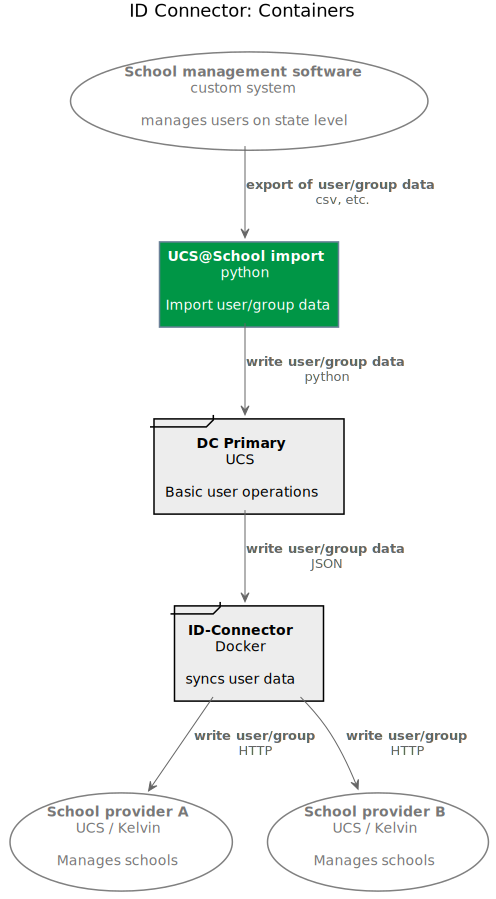
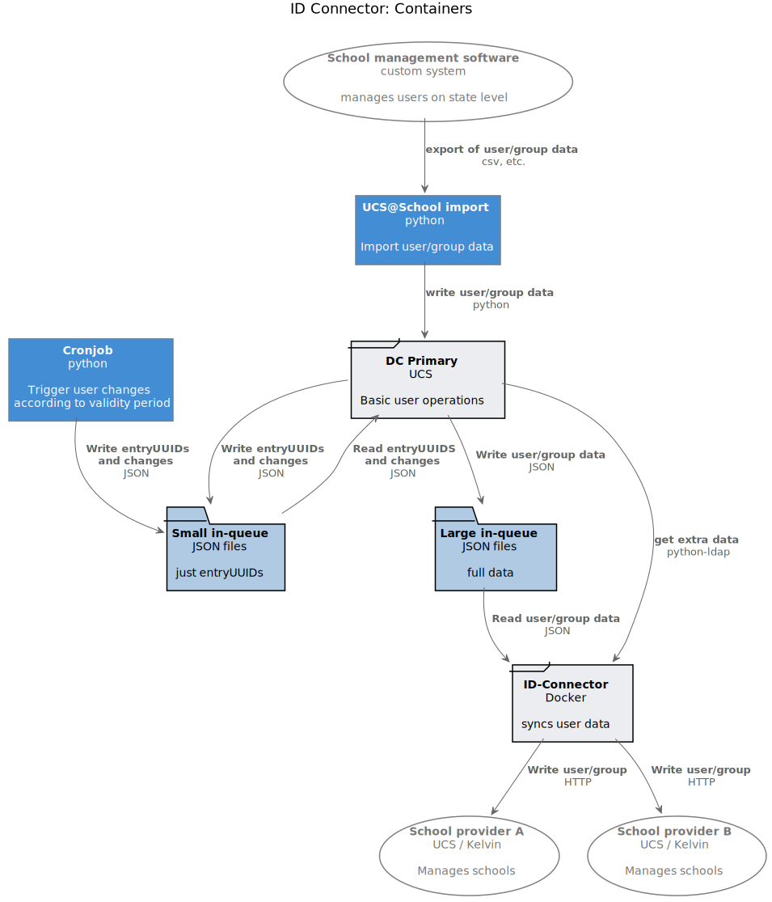
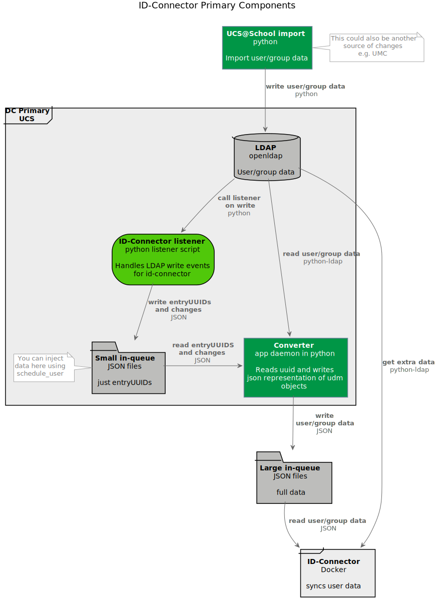
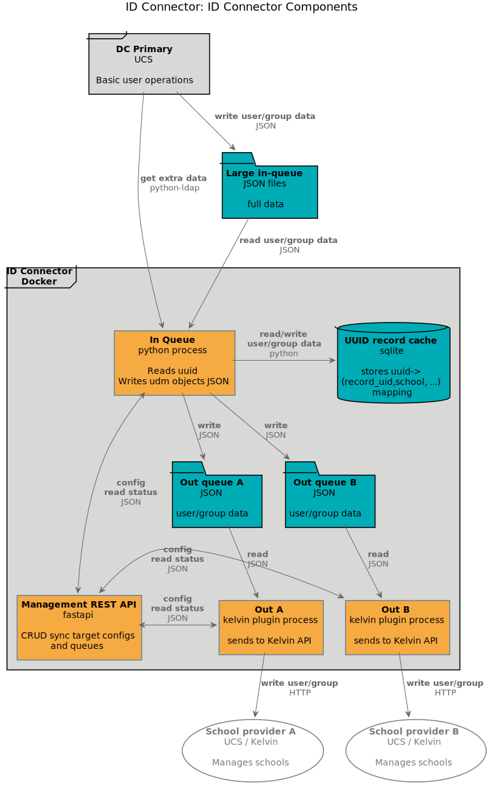
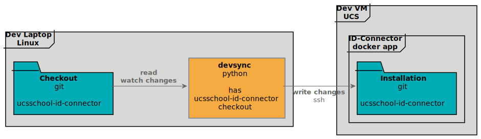
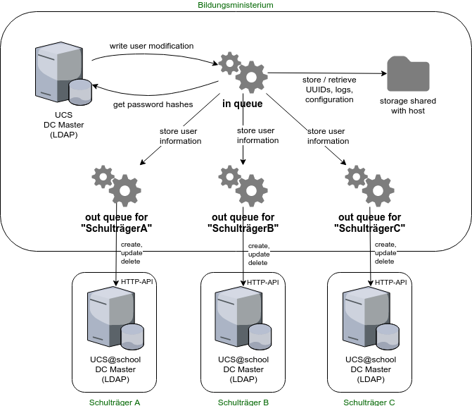

.. include:: <isonum.txt>
.. include:: univention_rst_macros.txt

***********
Development
***********

Overview
========

   |IDC| - Containers (`C4 Style <https://c4model.com/>`_)

.. include:: legend.txt

Here we have a different style of diagram compared to the last chapter ":doc:`admin`". It shows more
or less the same as in last chapter:

* The *school management software* that runs on the state level, and exports user data in a file
  format, e.g. csv.
* |iUAS| *import* which is a python script to import users into a *DC Primary UCS* System
* The *DC Primary UCS*  system passes on the user/group data to the actual *ID-Connector* running
  in a docker container
* The *ID-Connector* finally writes user/group data to the school providers.

This, of course, is a simplification. It is on a container level (in the sense used by
`C4 <https://c4model.com/>`_).

.. note::

   Arrows in these diagrams are in the direction of data flow. It should be apparent from the
   source and target nodes what the label on the arrow refers to.

Let's have a look at what you need to know before we dive any deeper.

Prerequisites
=============
First, we assume that you are already familiar with the chapter :doc:`admin`.

You also need the following knowledge to follow this manual and to develop for ID-Connector:

HTTP
   The foundation of data communication for the www. Our APIs use this

   You need to be able to:

   - understand http messages
   - understand auth concepts
   - understand error codes

   |rarr| https://developer.mozilla.org/en-US/docs/Web/HTTP

Python & pytest
   The great programming language and its testing module.

   You need to be able to:

   - code and debug python modules
   - test your code, ideally using pytest

   |rarr| https://python.org |br|
   |rarr| https://pytest.org

Fastapi
   The framework in which http APIs are developed.

   You need to be able to:

   - understand fastapi
   - understand dependency injection
   - understand pydantic models

   |rarr| https://fastapi.tiangolo.com/

Docker
   Software to isolate software and run them in containers.

   You need to be able to:

   - understand dockerfile basics
   - run containers
   - understand mounts

   |rarr| https://www.docker.com/

UDM REST-API
   A REST API which can be used to inspect, modify, create and delete UDM objects via HTTP requests.

   You need to be able to: TODO

   |rarr| https://docs.software-univention.de/developer-reference-4.4.html#udm:rest_api

UCS-APIs auth plugin
   Description

   You need to be able to: TODO

   |rarr| TODO

Kelvin REST API
   Description

   You need to be able to: TODO

   |rarr| https://docs.software-univention.de/ucsschool-kelvin-rest-api/

OPA (optional)
   Description

   You need to be able to: TODO

   |rarr| https://www.openpolicyagent.org/

Pre-commit (optional)

   Description

   You need to be able to: TODO

   |rarr| https://pre-commit.com/

Interactions and components
===========================

Ok, so are familiar with the above concepts? Great!

Now let's have a closer look at what's going on.

Overview, less simplified
-------------------------

.. include:: legend.txt

Ok, isn't this more or less the same as above in `Overview`_? Yes, right you are. The additional
element is the *Large in-queue*. This is a folder which interacts as the interface between the
*DC Primary* and the *ID-Connector*. JSON files are written to the folder, and then read out.

You also may notice the *get extra data* arrow. This means that the ID-Connector might need
extra data that is not contained in the JSON files. But before we come to this, we have a closer
look at the *DC Primary*

DC Primary
----------

.. include:: legend.txt

* The |iUCS| *import*, a python script, reads in e.g. CSV data, and writes the contained user and
  group data to the *LDAP*. As mentioned in the diagram there are also other mechanisms that
  modify the LDAP, the UMC being one of them. The point is that "somehow" user/group data
  arives

* The *ID-Connector listener* python script is then called by the LDAP machinery. It handles
  the write events that are of interest for the ID-Connector.

* In a first step this data is written to the *small in-queue". This is a folder containing
  minimal information (in JSON format), namely the type of change (add, update, delete) and
  the entryUUID of the concerned object. But why? Why not write directly to the *Converter*
  in the next step? Good question, I am glad you asked. The reason is twofold:

  1. Speed by decoupling - the LDAP listeners should be able to do their job as fast as possible,
     and shouldn't have to wait for the next processing steps. Hence the folder acting as a queue,
     and only writing minimal data.
  2. The folder can also act as an entry point for debugging and manual insertion of user data. E.g.
     you want to reschedule a user without import the user again? Use the ``schedule_user`` script,
     and this will write some JSON into this folder.

* The *Converter* runs as a daemon script, picks up the JSON files from the *small in-queue*,
  and fetches the actual data from the *LDAP* using the ``python-ldap``. It then puts a JSON
  representation of the UDM Object into the *Large in-queue*.

The *Large in-queue* in turn is read out by the *ID-Connector* running in a docker container.
Let's have a closer look:

ID-Connector
------------

.. include:: legend.txt

* We already know that he *DC Primary* writes data to the *Large in-queue*. This folder is
  accessible by the host UCS system as well be the *ID Connector* docker container (where
  it is mounted).
* *In Queue* is a python process, that reads out the *Large in-queue*. It still might need
  extra data from the LDAP in the *DC Primary*, which it will do using ``python-ldap``.
  For caching purposes it uses an ``sqlite`` database as a caching mechanism, the
  *UUDI record cache*.
* The *In Queue* decides, what user/group data to send where (using the
  :ref:`school_to_authority_mapping` in the process). For each potential recipient there is
  a separate *Out queue*. User/group data is written in JSON format into these folder.
* The JSON data is picked up the plugin processes, e.g. *Out A*. Usually there is only the
  ``Kelvin ID-Connector plugin``, which helps ID-Connector to talk to Kelvin REST APIs.
  The Kelvin plugin process then talks to Kelvin API on the *School provider A*, doing the final
  transmission of the user/group data.
* All this orchestrated by the *Management REST API*, which is mostly for managing out queues.
  (Hint: You have learned about this *Mangement REST API* in :ref:`ucs_school_id_connector_http_api`).

Complete picture
----------------

The complete picture might be a bit too full. If you want have it anyway, here are your choices:

.. collapse:: Complete overview, C4 style

    .. figure:: static/id-connector-unified.svg
       :target: _static/id-connector-unified.svg
       :width: 800

    .. include:: legend.txt

.. collapse:: Overview, manually drawn, with file locations

    .. figure:: static/ucsschool-id-connector_details2.svg
       :target: _static/ucsschool-id-connector_details2.svg
       :width: 800

       The |IDC|, *not* simplified.

Dev setup
==========

.. include:: legend.txt

We are going to develop with the following setup:

* You have a git *checkout* of the *ucsschool-id-connector* on your *dev machine*
* There you use the script *devsync* to synchronize changes,
* which are synced to the corresponding *installation* folder of the *ID-Connector* docker app.

Dev machine
-----------

Setup development environment:

.. code-block:: bash

    $ # clone ucsschool-id-connector
    $ cd ucsschool-id-connector
    $ make setup_devel_env
    $ . venv/bin/activate
    $ make install
    $ pre-commit run -a
    $

This will create a directory ``venv`` with a Python virtualenv with the app and all its dependencies in it.

You can later on also "activate" the ``venv`` using:

.. code-block:: bash

    $ . venv/bin/activate

.. warning::

    All other commands in the Makefile assume that the virtualenv is active.

Run ``make`` without argument to see more useful commands:

.. code-block:: bash

    $ make

    clean                     remove all build, test, coverage and Python artifacts
    clean-build               remove build artifacts
    clean-pyc                 remove Python file artifacts
    clean-test                remove test and coverage artifacts
    setup_devel_env           setup development environment (virtualenv)
    lint                      check style (requires Python interpreter activated from venv)
    format                    format source code (requires Python interpreter activated from venv)
    test                      run tests with the Python interpreter from 'venv'
    coverage                  check code coverage with the Python interpreter from 'venv'
    coverage-html             generate HTML coverage report
    install                   install the package to the active Python's site-packages
    build-docker-img          build docker image locally quickly
    build-docker-img-on-knut  copy source to docker.knut, build and push docker image

Dev VM
------

You need to install the ID-Connector app through the appcenter on your development vm.

When started through the appcenter use the following to enter the container of the app:

.. code-block:: bash

    $ univention-app shell ucsschool-id-connector

Inside the container you can use the system Python:

.. code-block:: bash

    /ucsschool-id-connector$ python3
    Python 3.8.2 (default, Feb 29 2020, 17:03:31)
    [GCC 9.2.0] on linux
    Type "help", "copyright", "credits" or "license" for more information.
    >>> from ucsschool_id_connector import models

    /ucsschool-id-connector$ ipython
    Python 3.8.2 (default, Feb 29 2020, 17:03:31)
    Type 'copyright', 'credits' or 'license' for more information
    IPython 7.13.0 -- An enhanced Interactive Python. Type '?' for help.

    In [1]: from ucsschool_id_connector import models

Now, in order to sync  your working copy into the running ID-Connector container on the dev vm,
we need to:

1. Stop the ID-Connector in it's container,
2. Find out its id,
3. Use this id to sync the files into the container,
4. Restart and prepare the container for development.

Lets do it!

.. code-block:: bash

    # [dev VM] stop the actual ID-Connector in it's docker container
    $ docker exec "$(ucr get appcenter/apps/ucsschool-id-connector/container)" \
      /etc/init.d/ucsschool-id-connector stop

    #[dev VM] find out the ID
    $ docker inspect --format='{{.GraphDriver.Data.MergedDir}}' \
    "$(ucr get appcenter/apps/ucsschool-id-connector/container)"

    →  /var/lib/docker/overlay2/8dc...387/merged

    # [developer machine] use the ID to sync our local modified files
    ucsschool-id-connector$ devsync -v src/ \
    <IP of dev VM>:/var/lib/docker/overlay2/8dc...387/merged/ucsschool-id-connector/

    # [dev VM] enter the container
    $ univention-app shell ucsschool-id-connector

    # [in container] install the dev requirements
    $ python3 -m pip install --no-cache-dir -r src/requirements.txt -r src/requirements-dev.txt

    # [in container] install ID-Connector from source in development mode
    $ python3 -m pip install -e src/

    # [in container] start the ID-Connector
    $ /etc/init.d/ucsschool-id-connector restart

    # [in container] stop the Rest API
    $ /etc/init.d/ucsschool-id-connector-rest-api stop

    # [in container] start the REST API in auto-reloading dev mode
    $ /etc/init.d/ucsschool-id-connector-rest-api-dev start

    # [in container] schedule a user
    $ src/schedule_user demo_teacher

    # DEBUG: Searching LDAP for user with username 'demo_teacher'...
    # INFO : Adding user to in-queue: 'uid=demo_teacher,cn=lehrer,cn=users,ou=DEMOSCHOOL,dc=uni,dc=dtr'.
    # DEBUG: Done.

    # Log is in /var/log/univention/ucsschool-id-connector/queues.log

    # [in container]
    $ cd src

    # [in container]
    $ python3 -m pytest -l -v

Install Kelvin API on sender for integration tests
--------------------------------------------------

A HTTP-API is required for the integration tests (running in the container) to be able to
create/modify/delete users in the host and the target systems:

.. code-block:: bash

    $ univention-app install ucsschool-kelvin-rest-api
    $ cp /usr/share/ucs-school-import/configs/ucs-school-testuser-http-import.json \
         /var/lib/ucs-school-import/configs/user_import.json
    $ python -c 'import json;\
                 fp = open("/var/lib/ucs-school-import/configs/user_import.json", "r+w");\
                 config = json.load(fp);\
                 config["configuration_checks"] = ["defaults", "mapped_udm_properties"];\
                 config["mapped_udm_properties"] = ["phone", "e-mail", "organisation"];\
                 fp.seek(0);\
                 json.dump(config, fp, indent=4, sort_keys=True);\
                 fp.close()'

To allow the integration tests to access the APIs it needs a way to retrieve the IP addresses.
Username "Administrator" and password "univention" is assumed.

Please execute on the sender system:

.. code-block:: bash

    $ echo IP_TRAEGER1 > /var/www/IP_traeger1.txt
    $ echo IP_TRAEGER2 > /var/www/IP_traeger2.txt

Plugin development
==================

The code of the *UCS\@school ID Connector* app can be adapted through plugins.
The ``pluggy`` plugin system is used to define, implement and call plugins. TODO: link to pluggy
To share code between plugins additional Python packages can be installed.
The following demonstrates a simple example of a custom Python packages
and a plugin for *UCS\@school ID Connector*.

All plugin *specifications* (function signatures) are defined in ``src/ucsschool_id_connector/plugins.py``.

The directory structure for custom plugins and packages can be found
in the host system below ``/var/lib/univention-appcenter/apps/ucsschool-id-connector/conf/``:

.. code-block:: bash

    /var/lib/univention-appcenter/apps/ucsschool-id-connector/conf/plugins/
    /var/lib/univention-appcenter/apps/ucsschool-id-connector/conf/plugins/packages/
    /var/lib/univention-appcenter/apps/ucsschool-id-connector/conf/plugins/plugins/

The app is released with default plugins, that implement a default version
for all specifications found in ``src/ucsschool_id_connector/plugins.py``.

An example plugin specification:

.. code-block:: python

    class DummyPluginSpec:
        @hook_spec(firstresult=True)
        def dummy_func(self, arg1, arg2):
            """An example hook."""

A directory structure for a custom plugin ``dummy`` and custom package ``example_package``
below ``/var/lib/univention-appcenter/apps/ucsschool-id-connector/conf/``:

.. code-block:: bash

    .../plugins/
    .../plugins/packages
    .../plugins/packages/example_package
    .../plugins/packages/example_package/__init__.py
    .../plugins/packages/example_package/example_module.py
    .../plugins/plugins
    .../plugins/plugins/dummy.py

Content of ``plugins/plugins/dummy.py``:

.. code-block:: python

    #
    # An example plugin that will be usable as "plugin_manager.hook.dummy_func()".
    # It uses a class from a module in a custom package:
    # plugins/packages/example_package/example_module.py
    #
    # The plugin specifications are in src/ucsschool_id_connector/plugins.py
    #

    from ucsschool_id_connector.utils import ConsoleAndFileLogging
    from ucsschool_id_connector.plugins import hook_impl, plugin_manager
    from example_package.example_module import ExampleClass

    logger = ConsoleAndFileLogging.get_logger(__name__)

    class DummyPlugin:
        @hook_impl
        def dummy_func(self, arg1, arg2):  # <-- this must match the specification!
            """
            Example plugin function.

            Returns the sum of its arguments.
            Uses a class from a custom package.
            """
            logger.info("Running DummyPlugin.dummy_func() with arg1=%r arg2=%r.", arg1, arg2)
            example_obj = ExampleClass()
            res = example_obj.add(arg1, arg2)
            assert res == arg1 + arg2
            return res

    # register plugins
    plugin_manager.register(DummyPlugin())

Content of ``plugins/packages/example_package/example_module.py``:

.. code-block:: python

    #
    # An example Python module that will be loadable as "example_package.example_module"
    # if stored in 'plugins/packages/example_package/example_module.py'.
    # Do not forget to create 'plugins/packages/example_package/__init__.py'.
    #

    from ucsschool_id_connector.utils import ConsoleAndFileLogging

    logger = ConsoleAndFileLogging.get_logger(__name__)

    class ExampleClass:
        def add(self, arg1, arg2):
            logger.info("Running ExampleClass.add() with arg1=%r arg2=%r.", arg1, arg2)
            return arg1 + arg2

When the app starts, all plugins will be discovered and logged:

.. code-block:: bash

   ...
   INFO  [ucsschool_id_connector.plugins.load_plugins:83] Loaded plugins: {.., <dummy.DummyPlugin object at 0x7fa5284a9240>}
   INFO  [ucsschool_id_connector.plugins.load_plugins:84] Installed hooks: [.., 'dummy_func']
   ...

Build release
=============

* Update the apps version in ``VERSION.txt``.
* Add an entry to ``src/HISTORY.rst``.
* Build and push Docker image to Docker registry

To upload ("push") a new Docker image to Univentions Docker registry
(``docker-test.software-univention.de``), run:

.. code-block:: bash

    $ cd ~/git/ucsschool-id-connector
    $ make build-docker-img-on-knut

Tests
=====

Unit tests are executed as part of the build process.
To start them manually in the installed apps running Docker container, run:

.. code-block:: bash

    root@ucs-host:# univention-app shell ucsschool-id-connector
    /ucsschool-id-connector # cd src/
    /ucsschool-id-connector/src # python3 -m pytest -l -v tests/unittests
    /ucsschool-id-connector/src # exit

To run integration tests (*not safe, will modify source and target systems!*), run:

.. code-block:: bash

    root@ucs-host:# univention-app shell ucsschool-id-connector
    /ucsschool-id-connector # cd src/
    /ucsschool-id-connector/src # python3 -m pytest -l -v tests/integration_tests
    /ucsschool-id-connector/src # exit

# schedule_user for testing

Old Diagrams and Texts
======================

   The |IDC|, *less* simplified

From Dev machine
----------------

Build Docker image:

.. code-block:: bash

    $ make build-docker-img

You could start the docker image on its own, but this doesn't make too much sense (see below):

.. code-block:: bash

    $ docker run -p 127.0.0.1:8911:8911/tcp --name ucsschool_id_connector \
      docker-test-upload.software-univention.de/ucsschool-id-connector:$(cat VERSION.txt)

Replace version (in above command ``1.0.0``) with current version. See ``APP_VERSION`` in the output
at the start of the build process.

.. note:
    Running the ID-Connector on your dev machine doesn't make much sense, because it requires
    a UCS setup, containing an LDAP, to work. So rather develop your code on your local machine,
    and ``devsync`` to an actual installation

From Dev VM
-----------
TODO To be continued

When the container is started that way (not through the appcenter)
it must be accessed through https://FQDN:8911/ucsschool-id-connector/api/v1/docs
after stopping the firewall (``service univention-firewall stop``).

You can also:

.. code-block:: bash

    # let it run in the background.
    $ docker run -d ...

    # see the stdout
    $ docker logs ucsschool_id_connector

    # stop the running container
    $ docker stop ucsschool_id_connector

    # remove the container
    $ docker rm ucsschool_id_connector

To enter the running container run:

.. code-block:: bash

    $ docker exec -it ucsschool_id_connector /bin/ash
