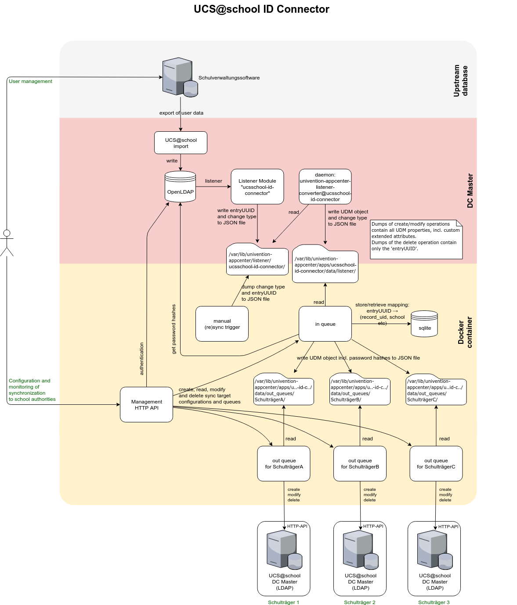

.. include:: <isonum.txt>
.. include:: univention_rst_macros.txt

***********
Development
***********
Overview
========

.. figure:: static/ucsschool-id-connector_overview2.png
   :target: _static/ucsschool-id-connector_overview2.png
   :width: 500

   The |IDC|, *less* simplified

   TODO: maybe use C4 Image? |br|
   TODO: english, master->primary

Prerequisites
=============

If you want to develop for/with the ID-Connector, this chapter is right for you. We assume that
you are already familiar with the chapter :doc:`admin`.

To follow this manual and to develop for ID-Connector, you also need the following knowledge:

http
   The foundation of data communication for the www. Our APIs use this

   You need to be able to:

   - understand http messages
   - understand auth concepts
   - understand error codes

   |rarr| https://developer.mozilla.org/en-US/docs/Web/HTTP

python & pytest
   The great programming language and its testing module.

   You need to be able to:

   - code and debug python modules
   - test your code, ideally using pytest

   |rarr| https://python.org |br|
   |rarr| https://pytest.org

fastapi
   The framework in which http APIs are developed.

   You need to be able to:

   - understand fastapi
   - understand dependency injection
   - understand pydantic models

   |rarr| https://fastapi.tiangolo.com/

docker
   Software to isolate software and run them in containers.

   You need to be able to:

   - understand dockerfile basics
   - run containers
   - understand mounts

   |rarr| https://www.docker.com/

udm rest api
   Description

   You need to be able to: TODO

   |rarr| TODO

opa
   Description

   You need to be able to: TODO

   |rarr| TODO

ucs api auth plugin
   Description

   You need to be able to: TODO

   |rarr| TODO

kelvin rest api
   Description

   You need to be able to: TODO

   |rarr| TODO

pre-commit

   Description

   You need to be able to: TODO

   |rarr| https://pre-commit.com/

Interactions and components
===========================

TODO Describe the inner workings

   The |IDC|, *not* simplified.

   TODO: maybe use C4 Image? |br|
   TODO: english, master->primary

Dev setup
==========

Setup development environment:

.. code-block:: bash

    $ cd ~/git/ucsschool-id-connector
    $ make setup_devel_env
    $ make install
    $ pre-commit run -a

This will create a directory ``venv`` with a Python virtualenv with the app and all its dependencies in it.
To activate it, run:

.. code-block:: bash

    $ . venv/bin/activate

Run ``make`` without argument to see more useful commands:

.. code-block:: bash

    $ make

    clean                remove all build, test, coverage and Python artifacts
    clean-build          remove build artifacts
    clean-pyc            remove Python file artifacts
    clean-test           remove test and coverage artifacts
    setup_devel_env      setup development environment (virtualenv)
    lint                 check style (requires Python interpreter activated from venv)
    format               format source code (requires Python interpreter activated from venv)
    test                 run tests with the Python interpreter from 'venv'
    coverage             check code coverage with the Python interpreter from 'venv'
    coverage-html        generate HTML coverage report
    install              install the package to the active Python's site-packages
    build-docker-img     build docker image locally quickly
    build-docker-img-on-knut copy source to docker.knut, build and push docker image

*All other commands in the Makefile assume that the virtualenv is active.*

Build Docker image:

.. code-block:: bash

    $ cd ~/git/ucsschool-id-connector
    $ make build-docker-img

The Docker image can be started on its own (but won't receive JSON files
in the in queue from the listener in the host) by running:

.. code-block:: bash

    $ docker run -p 127.0.0.1:8911:8911/tcp --name ucsschool_id_connector \
      docker-test-upload.software-univention.de/ucsschool-id-connector:1.0.0

Replace version (in above command ``1.0.0``) with current version. See ``APP_VERSION`` in the output
at the start of the build process.

When the container is started that way (not through the appcenter)
it must be accessed through https://FQDN:8911/ucsschool-id-connector/api/v1/docs
after stopping the firewall (``service univention-firewall stop``).

You can also:

.. code-block:: bash

    # let it run in the background.
    $ docker run -d ...

    # see the stdout
    $ docker logs ucsschool_id_connector

    # stop the running container
    $ docker stop ucsschool_id_connector

    # remove the container
    $ docker rm ucsschool_id_connector

To enter the running container run:

.. code-block:: bash

    $ docker exec -it ucsschool_id_connector /bin/ash

When started through the appcenter use:

.. code-block:: bash

    $ univention-app shell ucsschool-id-connector

Inside the container you can use the system Python:

.. code-block:: bash

    /ucsschool-id-connector # python3
    Python 3.8.2 (default, Feb 29 2020, 17:03:31)
    [GCC 9.2.0] on linux
    Type "help", "copyright", "credits" or "license" for more information.
    >>> from ucsschool_id_connector import models

    /ucsschool-id-connector # ipython
    Python 3.8.2 (default, Feb 29 2020, 17:03:31)
    Type 'copyright', 'credits' or 'license' for more information
    IPython 7.13.0 -- An enhanced Interactive Python. Type '?' for help.

    In [1]: from ucsschool_id_connector import models

Install Kelvin API on sender for integration tests
--------------------------------------------------

A HTTP-API is required for the integration tests (running in the container) to be able to
create/modify/delete users in the host and the target systems:

.. code-block:: bash

    $ univention-app install ucsschool-kelvin-rest-api
    $ cp /usr/share/ucs-school-import/configs/ucs-school-testuser-http-import.json \
         /var/lib/ucs-school-import/configs/user_import.json
    $ python -c 'import json;
                 fp = open("/var/lib/ucs-school-import/configs/user_import.json", "r+w");\
                 config = json.load(fp);\
                 config["configuration_checks"] = ["defaults", "mapped_udm_properties"];\
                 config["mapped_udm_properties"] = ["phone", "e-mail", "organisation"];\
                 fp.seek(0);\
                 json.dump(config, fp, indent=4, sort_keys=True);\
                 fp.close()'

To allow the integration tests to access the APIs it needs a way to retrieve the IP addresses.
Username "Administrator" and password "univention" is assumed.

Please execute on the sender system:

.. code-block:: bash

    $ echo IP_TRAEGER1 > /var/www/IP_traeger1.txt
    $ echo IP_TRAEGER2 > /var/www/IP_traeger2.txt

Using devsync with running app container
----------------------------------------

Sync your working copy into the running container, enter it and restart the services:

.. code-block:: bash

    # [test VM]
    $ docker exec "$(ucr get appcenter/apps/ucsschool-id-connector/container)" \
      /etc/init.d/ucsschool-id-connector stop

    #[test VM]
    $ docker inspect --format='{{.GraphDriver.Data.MergedDir}}' \
    "$(ucr get appcenter/apps/ucsschool-id-connector/container)"

    →  /var/lib/docker/overlay2/8dc...387/merged

    # [developer machine]
    ~/git/ucsschool-id-connector$ devsync -v src/ \
    10.200.3.66:/var/lib/docker/overlay2/8dc...387/merged/ucsschool-id-connector/

    # [test VM]
    $ univention-app shell ucsschool-id-connector

    # [in container]
    $ python3 -m pip install --no-cache-dir -r src/requirements.txt -r src/requirements-dev.txt

    # [in container]
    $ python3 -m pip install -e src/

    # [in container]
    $ /etc/init.d/ucsschool-id-connector restart

    # [in container]
    $ /etc/init.d/ucsschool-id-connector-rest-api stop

    # [in container]
    $ /etc/init.d/ucsschool-id-connector-rest-api-dev start
    #                       auto-reload HTTP-API ^^^^

    # [in container]
    $ src/schedule_user demo_teacher

    # DEBUG: Searching LDAP for user with username 'demo_teacher'...
    # INFO : Adding user to in-queue: 'uid=demo_teacher,cn=lehrer,cn=users,ou=DEMOSCHOOL,dc=uni,dc=dtr'.
    # DEBUG: Done.

    # Log is in /var/log/univention/ucsschool-id-connector/queues.log

    # [in container]
    $ cd src

    # [in container]
    $ python3 -m pytest -l -v

Plugin development
==================

The code of the *UCS\@school ID Connector* app can be adapted through plugins.
The ``pluggy`` plugin system is used to define, implement and call plugins. TODO: link to pluggy
To share code between plugins additional Python packages can be installed.
The following demonstrates a simple example of a custom Python packages
and a plugin for *UCS\@school ID Connector*.

All plugin *specifications* (function signatures) are defined in ``src/ucsschool_id_connector/plugins.py``.

The directory structure for custom plugins and packages can be found
in the host system below ``/var/lib/univention-appcenter/apps/ucsschool-id-connector/conf/``:

.. code-block:: bash

    /var/lib/univention-appcenter/apps/ucsschool-id-connector/conf/plugins/
    /var/lib/univention-appcenter/apps/ucsschool-id-connector/conf/plugins/packages/
    /var/lib/univention-appcenter/apps/ucsschool-id-connector/conf/plugins/plugins/

The app is released with default plugins, that implement a default version
for all specifications found in ``src/ucsschool_id_connector/plugins.py``.

An example plugin specification:

.. code-block:: python

    class DummyPluginSpec:
        @hook_spec(firstresult=True)
        def dummy_func(self, arg1, arg2):
            """An example hook."""

A directory structure for a custom plugin ``dummy`` and custom package ``example_package``
below ``/var/lib/univention-appcenter/apps/ucsschool-id-connector/conf/``:

.. code-block:: bash

    .../plugins/
    .../plugins/packages
    .../plugins/packages/example_package
    .../plugins/packages/example_package/__init__.py
    .../plugins/packages/example_package/example_module.py
    .../plugins/plugins
    .../plugins/plugins/dummy.py

Content of ``plugins/plugins/dummy.py``:

.. code-block:: python

    #
    # An example plugin that will be usable as "plugin_manager.hook.dummy_func()".
    # It uses a class from a module in a custom package:
    # plugins/packages/example_package/example_module.py
    #
    # The plugin specifications are in src/ucsschool_id_connector/plugins.py
    #

    from ucsschool_id_connector.utils import ConsoleAndFileLogging
    from ucsschool_id_connector.plugins import hook_impl, plugin_manager
    from example_package.example_module import ExampleClass

    logger = ConsoleAndFileLogging.get_logger(__name__)

    class DummyPlugin:
        @hook_impl
        def dummy_func(self, arg1, arg2):  # <-- this must match the specification!
            """
            Example plugin function.

            Returns the sum of its arguments.
            Uses a class from a custom package.
            """
            logger.info("Running DummyPlugin.dummy_func() with arg1=%r arg2=%r.", arg1, arg2)
            example_obj = ExampleClass()
            res = example_obj.add(arg1, arg2)
            assert res == arg1 + arg2
            return res

    # register plugins
    plugin_manager.register(DummyPlugin())

Content of ``plugins/packages/example_package/example_module.py``:

.. code-block:: python

    #
    # An example Python module that will be loadable as "example_package.example_module"
    # if stored in 'plugins/packages/example_package/example_module.py'.
    # Do not forget to create 'plugins/packages/example_package/__init__.py'.
    #

    from ucsschool_id_connector.utils import ConsoleAndFileLogging

    logger = ConsoleAndFileLogging.get_logger(__name__)

    class ExampleClass:
        def add(self, arg1, arg2):
            logger.info("Running ExampleClass.add() with arg1=%r arg2=%r.", arg1, arg2)
            return arg1 + arg2

When the app starts, all plugins will be discovered and logged:

.. code-block:: bash

   ...
   INFO  [ucsschool_id_connector.plugins.load_plugins:83] Loaded plugins: {.., <dummy.DummyPlugin object at 0x7fa5284a9240>}
   INFO  [ucsschool_id_connector.plugins.load_plugins:84] Installed hooks: [.., 'dummy_func']
   ...

Build release
=============

* Update the apps version in ``VERSION.txt``.
* Add an entry to ``src/HISTORY.rst``.
* Build and push Docker image to Docker registry

To upload ("push") a new Docker image to Univentions Docker registry
(``docker-test.software-univention.de``), run:

.. code-block:: bash

    $ cd ~/git/ucsschool-id-connector
    $ make build-docker-img-on-knut

Tests
=====

Unit tests are executed as part of the build process.
To start them manually in the installed apps running Docker container, run:

.. code-block:: bash

    root@ucs-host:# univention-app shell ucsschool-id-connector
    /ucsschool-id-connector # cd src/
    /ucsschool-id-connector/src # python3 -m pytest -l -v tests/unittests
    /ucsschool-id-connector/src # exit

To run integration tests (*not safe, will modify source and target systems!*), run:

.. code-block:: bash

    root@ucs-host:# univention-app shell ucsschool-id-connector
    /ucsschool-id-connector # cd src/
    /ucsschool-id-connector/src # python3 -m pytest -l -v tests/integration_tests
    /ucsschool-id-connector/src # exit
