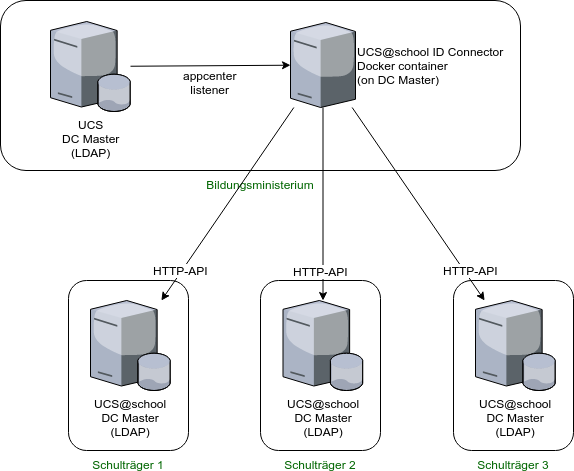

.. UCS\@school ID Connector documentation master file, created by
   sphinx-quickstart on Tue Nov  2 14:56:07 2021.
   You can adapt this file completely to your liking, but it should at least
   contain the root `toctree` directive.
.. include:: <isonum.txt>

Welcome to UCS\@school ID Connector's documentation!
===================================================

.. image:: https://img.shields.io/badge/License-AGPL%20v3-orange.svg
    :alt: GNU AGPL V3 license
    :target: https://www.gnu.org/licenses/agpl-3.0
.. image:: https://img.shields.io/badge/python-3.8-blue.svg
    :alt: Python 3.8
    :target: https://www.python.org/downloads/release/python-382/

Overview
========

The UCS\@school ID Connector connects a UCS\@school directory to any number of other UCS\@school directories (1:n). It is designed to connect state directories with school districts, but can also be used in other contexts. The connection takes place unidirectional: user data (user, school affiliation, class affiliations) are transferred from a central directory (e.g. country directory) to district or school directories. Prerequisite is the use of the UCS\@school Kelvin API on the school authorities. For this a configuration is necessary in advance to create an assignment "Which school users should be transferred to which remote instance?" Then these users are created, updated and deleted.

In this documentation you will learn how to administer ad id-connector setup, and we hope to teach you how to develop plugins for id-connector as well.

High level picture
------------------

   An example id-connector setup

TODO:

- Master -> Primary
- English

Audience and prerequisites
==========================

We need to make some assumptions on what you already know.

Integrator / Administrator
--------------------------

If you need to mainly administer an id-connector setup, you should be familiar with the following aspects of the UCS environment:

Ldap and ldap listener
   LDAPAn openldap server that contains the user data. LDAP ACLs are used to restrict access. It shouldn't
   be accessed directly, instead the udm library should be used. Openldap can have plugins, notifier being one
   of them that is heavily used in ucs. Upon changes in the ldap directory the notifier triggers listeners
   locally and on remote systems.

   The listener service connects to all local or remote notifiers in the domain. The listener, when notified,
   calls listener modules, which are scripts (in shell and python)

   You need to be able to: TODO

   read more: TODO

UDM
   Univention Directory Management is used for handling user data that is stored in the ldap
   server, one of two core storage places (the other one is ucr). Examples for data are
   users, roles or machine info. Ldap is used (instead of e.g. sql databases) because it is
   optimized for reading in a hierarchical structure. UDM adds a layer of functionality and logic on
   top of ldap, hence ldap shouldn't be used directly.

   You need to be able to: TODO

   read more: TODO

ucr
   The Univention Config Registry. This stores variables and settings to run the system. It also
   creates and changes actual linux configuration files according to these variables.

   You need to be able to: TODO

   read more: TODO

appcenter settings
    Description

   You need to be able to: TODO

   read more: TODO

ucs\@school basics
   Schools have special requirements for managing what is going on inside them (teachers, students,
   staff, computer rooms, exams, etc.), but also managing the relation between multiple schools, their
   operator organizations ("Schulbetreiber"), and possibly ministerial departments above them.

   There are several components within ucs\@school, kelvin (see below) being one of them.

   You need to be able to:
   - know about ucs\@school objects
   - know the difference between ucs\@school-objects and udm objects

   read more: TODO

Kelvin administration
   The UCS\@school Kelvin REST API provides HTTP endpoints to create and manage individual UCS\@school
   domain objects like school users, school classes, schools (OUs) and computer rooms. This is written
   in fastapi, hence in python3.

   You need to be able to: TODO

   read more: https://docs.software-univention.de/ucsschool-kelvin-rest-api/overview.html

Developer
---------

python & pytest
   The great programming language and its testing module.

   You need to be able to:
   - code and debug python modules
   - test your code using pytest

   read more:
      - https://python.org, https://diveintopython3.net/
      - https://pytest.org

fastapi
    Description
   You need to be able to: TODO

   read more: https://fastapi.tiangolo.com/

docker
    description

   You need to be able to: TODO

   read more: https://www.docker.com/

http
    description

   You need to be able to: TODO

   read more: https://developer.mozilla.org/en-US/docs/Web/HTTP

Contents
========

.. toctree::
   :maxdepth: 2

   admin
   plugins
   example
   example2

Indices and tables
==================

* :ref:`genindex`
* :ref:`modindex`
* :ref:`search`

